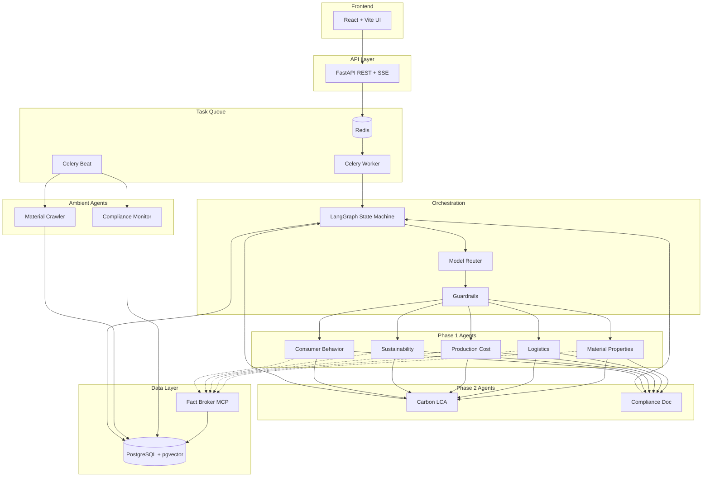

# Sustainable Packaging Multi-Agent Platform 🌱📦


An enterprise-grade, multi-agent orchestration platform designed to automate the evaluation, compliance, and selection of sustainable packaging materials. Powered by Google Gemini, LangGraph, and a scalable background execution model with SOTA GenAI practices built in.

## 🎯 Overview

This platform leverages a **Dynamic Agent Registry**, a **Fact Broker** for evidence-based grounding, and **Ambient Agents** for continuous intelligence to provide region-specific packaging recommendations — without hallucinating facts.

### Key SOTA Features

| Feature | Implementation |
|---------|---------------|
| **Model Cascading** | Flash → Pro fallback via `ModelRouter` |
| **Structured Outputs** | Pydantic `response_model` on every agent |
| **Harness Engineering** | Async timeouts, tenacity retry, defensive sandboxing |
| **Context Engineering** | pgvector RAG, semantic caching, token budgeting |
| **Responsible AI** | Input/output guardrails for prompt injection & ungrounded safety claims |
| **Ambient Agents** | Celery Beat: weekly compliance monitor + daily material crawler |
| **LLMOps** | Langfuse tracing, structured JSON logging, Sentry error tracking |
| **Agentic Reflection** | Self-verification loop for low-confidence outputs |

## 🏗️ Architecture



### Core Components
1. **Frontend (React & Vite)**: Premium UI with real-time SSE progress streaming (`frontend/src/App.tsx`).
2. **Backend API (FastAPI)**: REST endpoints with API versioning (`/api/v1/`), SSE streaming, and deep health checks (`api/main.py`).
3. **Task Queue (Celery & Redis)**: LangGraph executions run as async Celery tasks. Celery Beat drives ambient agents.
4. **Orchestrator (LangGraph & Postgres)**: State machine with `AsyncPostgresSaver` for durable checkpoints.
5. **Dynamic Agent Registry**: Routes execution only to agents whose trigger conditions are met — strictly bounding token usage.
6. **Fact Broker MCP**: Cached, authoritative grounding (EUR-Lex, DEFRA, Open Food Facts) to prevent hallucinations.
7. **Model Router**: Cascading model selection (Flash for extraction, Pro for synthesis) with automatic fallback.
8. **Guardrails**: Input validation (prompt injection defense) and output validation (ungrounded safety claim detection).

### The Agent Roster
- **Phase 1 Analysts**: `MaterialProperties`, `Logistics`, `ProductionCost`, `Sustainability`, `ConsumerBehavior`
- **Phase 2 Synthesis**: `CarbonLcaService` (kg-CO₂e deltas), `ComplianceDocService` (PPWR Declaration)
- **Ambient Agents**: `ComplianceMonitor` (weekly regulatory scan), `MaterialCrawler` (daily material discovery)

## 🚀 Getting Started

### Prerequisites
- Docker and Docker Compose
- Google Gemini API Key

### Installation & Execution
1. Clone the repository:
   ```bash
   git clone https://github.com/codegeek03/Multi_Agent_Architecture_for_Sustainable_Packaging.git
   cd Multi_Agent_Architecture_for_Sustainable_Packaging
   ```
2. Configure Environment:
   ```bash
   cp .env.example .env
   # Add your GEMINI_API_KEY to the .env file
   ```
3. Boot the Infrastructure:
   ```bash
   docker-compose up --build
   ```
   This spins up:
   - `redis` (Message Broker & Pub/Sub)
   - `postgres` (pgvector — State Checkpoints, Knowledge Embeddings, Analysis History)
   - `celery_worker` (Background LangGraph Execution)
   - `celery_beat` (Ambient Agent Scheduler)
   - `api` (FastAPI on `http://localhost:8000`)
   - `frontend` (React UI on `http://localhost:5173`)

4. Navigate to `http://localhost:5173` to start your packaging analysis.

## 🛡️ DevOps & LLMOps

- **CI Pipeline** (`.github/workflows/ci.yml`): Lint (`ruff`, `mypy`), unit tests with coverage, security scans (`pip-audit`, `gitleaks`), Docker build smoke test, LLM eval harness on PRs.
- **CD Pipeline** (`.github/workflows/cd.yml`): On merge to `main`, builds and pushes to GitHub Container Registry.
- **LLM Eval Harness**: Golden test cases scored by LLM-as-a-judge for factual accuracy, citation quality, and completeness.
- **Observability**: Structured JSON logging, Sentry integration, optional Langfuse tracing.
- **Architecture Decision Records (ADRs)**: Documented in `docs/adr/`.

## 📂 Repository Structure

```text
├── agents/                    # Legacy/Utility input agents
├── api/                       # FastAPI REST API (SSE, versioned endpoints)
├── frontend/                  # React + Vite UI
├── libs/shared/               # Core schemas, registry, tasks, guardrails, evals
├── services/                  # Microservice agents (one per analysis dimension)
│   ├── base/                  # BaseAgent, ModelRouter, PromptLoader, ToolRegistry
│   ├── ambient/               # Ambient agents (compliance monitor, material crawler)
│   ├── fact_broker/           # MCP fact broker with circuit breaker + cache
│   ├── orchestrator/          # Executive summary synthesis agent
│   └── ...                    # material_properties, logistics, cost, etc.
├── prompts/                   # Versioned XML-structured system prompts
├── scripts/                   # DB init scripts (pgvector, tables)
├── docs/adr/                  # Architecture Decision Records
├── tests/                     # Unit, Contract, and Integration tests
├── main.py                    # LangGraph Orchestrator definitions
├── docker-compose.yml         # Infrastructure topology
├── Dockerfile                 # Multi-stage production container
└── .github/workflows/         # CI + CD pipelines
```

## 🤝 Contributing
1. Create a feature branch off `main`.
2. Ensure your changes pass the CI pipeline (Pydantic contract tests + LLM eval harness).
3. Submit a Pull Request for review.

## 📄 License
This project is licensed under the MIT License.
