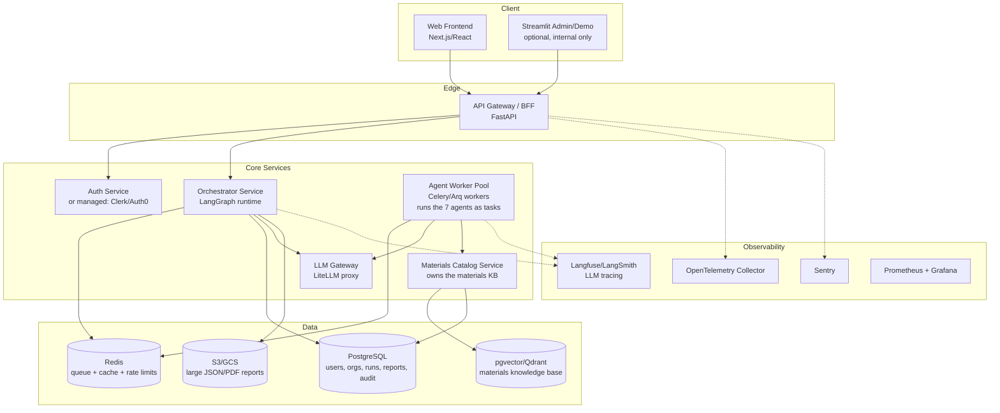

# From Hackathon Prototype to Production: Sustainable Packaging Multi-Agent Platform

**Source repo audited:** `codegeek03/Multi_Agent_Architecture_for_Sustainable_Packaging`
**Purpose of this document:** a phased, evidence-based plan (one phase per session/PR) to turn this prototype into a dockerized, microservices-based, multi-tenant SaaS backend that a real team could run in production.

---

## Part 1 — What's actually in the repo today

It's a single-process app: `main.py` builds a **LangGraph** state machine, `app.py` is a **Streamlit** UI that imports `main.py` directly and calls `graph.ainvoke()` in-process. Seven "agents" (`agents/*.py`) are thin wrappers around an **Agno** `Agent` + Google **Gemini 2.0 Flash**, each independently instantiating its own LLM client, tool set (Tavily, DuckDuckGo, Newspaper4k), and prompt. There is no API layer, no database, no auth, no tests, no Dockerfile, and no CI.

This is a solid proof-of-concept of the *reasoning* pipeline. It is not close to production, and not because it needs polish — it has structural problems that will actively break under real usage. Below is the concrete evidence, not a generic checklist.

### 1.1 Hardcoding, cited

| Issue | Evidence |
|---|---|
| Fake "current time"/user baked into source, not computed at runtime | `agents/Consumer_Behaviour_Analyst.py:27` `self.current_time = "2025-04-19 21:34:07"`; identical pattern in `Logistics_Analyst.py:22`, `Material_Analyst.py:25`, `Sourcing_Cost_Analyser.py:25`, `Sustainability_Analyst.py:29`, `Product_Analyst.py:49-50`, `main.py:30-31`, `orchestrator.py:26-27`. Every agent has its own **different** frozen timestamp. Reports are stamped with a constant from May/April 2025 regardless of when the run actually happens. |
| `CURRENT_USER = "codegeek03"` compiled into 4 different files | `main.py:30`, `orchestrator.py:26`, `MaterialDB_agent.py:28`, plus per-agent `self.user_login = "codegeek03"`. There is no concept of an actual authenticated user — the literal string is the "user" for every report, forever. |
| Model ID string duplicated 7 times | `"gemini-2.0-flash-exp"` hardcoded independently in every agent's constructor default *and* inside the `Gemini(id=...)` call (`Consumer_Behaviour_Analyst.py:16,31`, `Logistics_Analyst.py:14,26`, `Material_Analyst.py:14,29`, `Sourcing_Cost_Analyser.py:14,29`, `Sustainability_Analyst.py:18,33`, `Product_Analyst.py:26,55`, `MaterialDB_agent.py:160,175`). Orchestrator uses yet a different model, `"gemini-2.0-flash"` (`orchestrator.py:86`). Changing providers/models means editing 8 files by hand and hoping you don't miss one. |
| Analysis weights (`0.1/0.1/0.1/0.4/0.2`) duplicated in 3 places | `agents/detail_input.py:23-27`, `main.py:314-318` (as `.get(..., default)` fallbacks), `app.py:762-766` (Streamlit slider defaults). They will drift out of sync the first time someone tweaks one. |
| Storage path `"temp_KB"` hardcoded 18+ times across files | e.g. `Consumer_Behaviour_Analyst.py`, `Material_Analyst.py`, `Sustainability_Analyst.py`, `Sourcing_Cost_Analyser.py`, `orchestrator.py`, `main.py`. It's a local relative directory on disk — in any container/serverless/multi-replica deployment this data disappears on restart and can't be shared across instances. |
| LLM JSON output parsed by manually stripping ` ```json ` fences then `json.loads()` | Repeated verbatim in every agent (e.g. `Material_Analyst.py`, `Logistics_Analyst.py`, `Sourcing_Cost_Analyser.py`, `Sustainability_Analyst.py`, `Consumer_Behaviour_Analyst.py`). No schema validation, no retry on malformed JSON, no partial-failure handling — one malformed response and `json.loads` throws, which is caught only by a generic `except Exception` that returns an `"error"` dict silently swallowed downstream. |
| Composite scoring assumes every agent returns exactly a 0–10 float under an exact key name | `main.py`'s `orchestrate_results()` does `m["overall_consumer_score"] * 10`, `m["logistics_score"] * 10`, etc. If the LLM ever names a field slightly differently (which free-text prompted JSON absolutely will, eventually), this throws a `KeyError` deep in orchestration with no schema contract to catch it earlier. |
| `LangGraph` checkpointer is `MemorySaver()` | `main.py`, `create_analysis_graph()`. In-process RAM only — a pod restart, a deploy, or running >1 replica loses every in-flight run. No resumability, no audit trail. |
| Streamlit calls the whole graph synchronously in the request thread with a **fake progress bar** | `app.py` `main()`: it hardcodes 8 cosmetic status strings and does `await asyncio.sleep(0.5)` between them while the real `analysis_task` runs concurrently — the "progress" shown to the user is disconnected from actual agent completion. There's no queue, so two users analyzing at once compete for the same Streamlit server thread. |
| `requirements.txt` is a raw `pip freeze` dump, UTF-16 encoded, 300+ packages | Includes full **Django** (`Django==5.2.1`, `django-mptt`, `django-nyt`, `django-sekizai`...), **Playwright** + **Crawl4AI**, `jupyter`/`ipython`, `matplotlib`, `wikipedia`, `tweepy` — none of which the actual application code imports. This isn't a dependency list, it's a snapshot of a dev virtualenv. It roughly quadruples image size, multiplies the CVE surface, and makes reproducible builds impossible (no lockfile, no separation of runtime vs. dev deps). |
| Duplicate function definitions | `get_content_json`/`fetch_url_content` are defined identically in both `agents/context.py` **and** `agents/MaterialDB_agent.py` — a maintenance foot-gun; the two copies will silently diverge. |
| No retry/backoff anywhere | `tenacity` is even in `requirements.txt` but never imported/used. A single transient Gemini or Tavily hiccup fails the whole 6-agent pipeline. |
| Materials knowledge base is fully commented out | `MaterialDB_agent.py` and `orchestrator.py` both have a `LanceDb` + `GeminiEmbedder` knowledge-tools block entirely commented out. In practice every run re-derives material properties, prices and regulations from scratch via live web search + LLM "knowledge," which is slow (minutes per run), expensive (6+ LLM calls × multiple tool calls, every single time, even for a repeat query), and the biggest single source of hallucination risk in the system. |
| Secrets loaded via local `.env` + `python-dotenv` only | No secrets manager, no key rotation, no distinction between environments. Fine for a laptop demo, not for a team. |

### 1.2 Architectural gaps that aren't "hardcoding" but are equally blocking

- **No API layer.** `fastapi`/`uvicorn` are in `requirements.txt` but unused — the only entry points are a CLI (`main.py`, uses `input()`) and a Streamlit form.
- **No persistence layer.** Nothing is queryable; results are JSON files on local disk (`temp_KB/reports/*.json`). No history, no dashboards, no multi-user separation.
- **No auth, no multi-tenancy, no rate limiting, no cost caps.** Nothing stops one user's request from making unbounded LLM/search-tool calls.
- **No tests, no CI/CD, no Dockerfile.**
- **Tight coupling.** `agents/*.py` import each other and `main.py` imports all seven agent classes directly — there's no service boundary anywhere, so "microservices" today would mean re-architecting, not just containerizing.

---

## Part 2 — Target architecture

### 2.1 Service Boundaries



**Services:**
1. **`api-gateway`** (FastAPI) — auth, request validation, rate limiting, REST/WS API.
2. **`orchestrator`** — owns the LangGraph state machine with Postgres checkpointer.
3. **`agent-workers`** — horizontally-scalable task workers executing agent logic.
4. **`materials-catalog`** — materials database with vector index for fast, cached retrieval.
5. **`llm-gateway`** — LiteLLM proxy managing model routing, retries, cost tracking.
6. **`auth`** — Managed provider (Clerk, Auth0, Supabase Auth) behind gateway.
7. **Frontend** — Next.js customer-facing app, Streamlit kept as internal tool.

### 2.2 Data Model (PostgreSQL)

```
organizations(id, name, plan, monthly_llm_budget_usd, created_at)
users(id, org_id, email, role, created_at)
analysis_runs(id, org_id, user_id, product_name, input_json, status, weights_json,
               started_at, completed_at, error, total_llm_cost_usd)
run_events(id, run_id, node_name, status, started_at, completed_at, raw_output_json)
materials(id, name, category, source, properties_json, last_verified_at)
material_embeddings(material_id, embedding vector(768))
reports(id, run_id, storage_url, format)
```

---

## Part 3 — Phased Rollout Plan

- **Phase 0** — Repo hygiene and safety net (no behavior change)
- **Phase 1** — Extract shared config and schemas (`libs/shared`)
- **Phase 2** — Structured LLM I/O + retries (`tenacity`)
- **Phase 3** — Persistence layer (PostgreSQL + LangGraph Postgres checkpointer)
- **Phase 4** — API layer (FastAPI Gateway, REST/WS endpoints, auth)
- **Phase 5** — Split into orchestrator + worker pool (Celery/Arq + Redis)
- **Phase 6** — Materials catalog service (pgvector search, cached materials)
- **Phase 7** — LLM gateway + cost governance (LiteLLM proxy, budget caps)
- **Phase 8** — Observability (OTEL, Langfuse, Sentry, Prometheus/Grafana)
- **Phase 9** — Dockerize + CI/CD (docker-compose, multi-stage Dockerfiles, GitHub Actions)
- **Phase 10** — Frontend (Next.js web app)
- **Phase 11** — Load testing and hardening (k6 / locust, chaos recovery tests)
